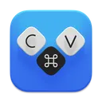
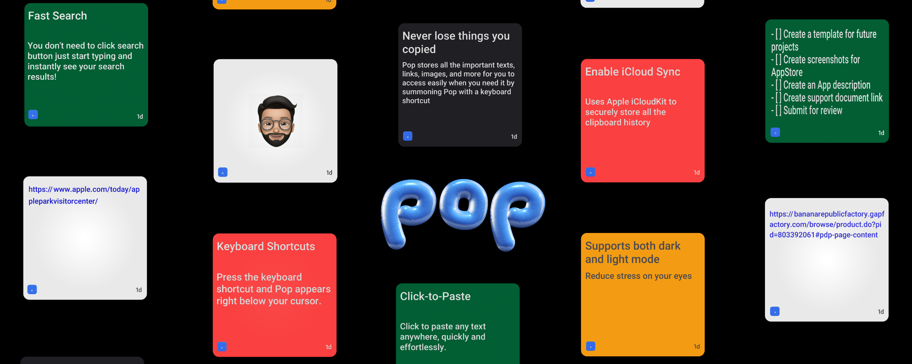
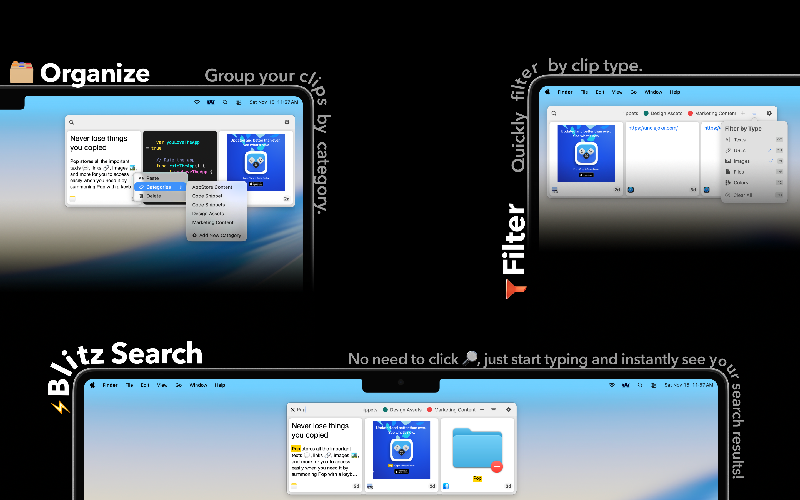
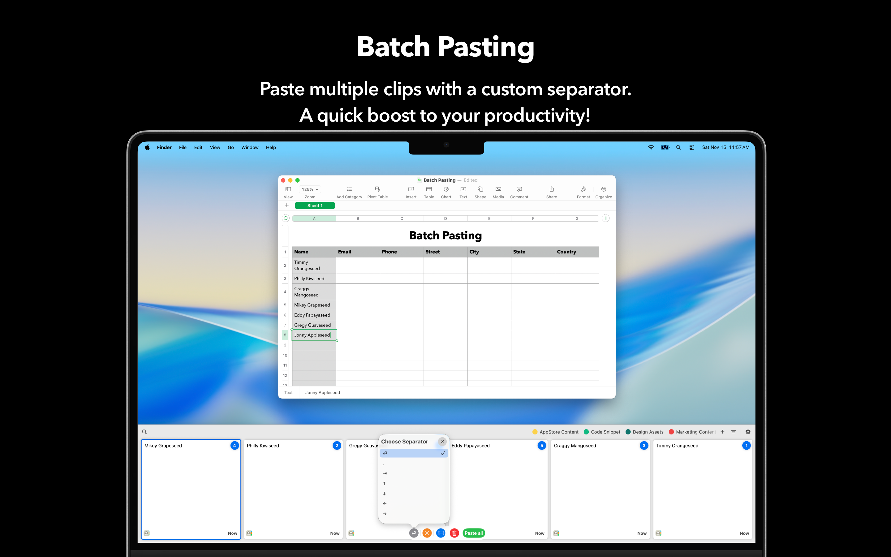
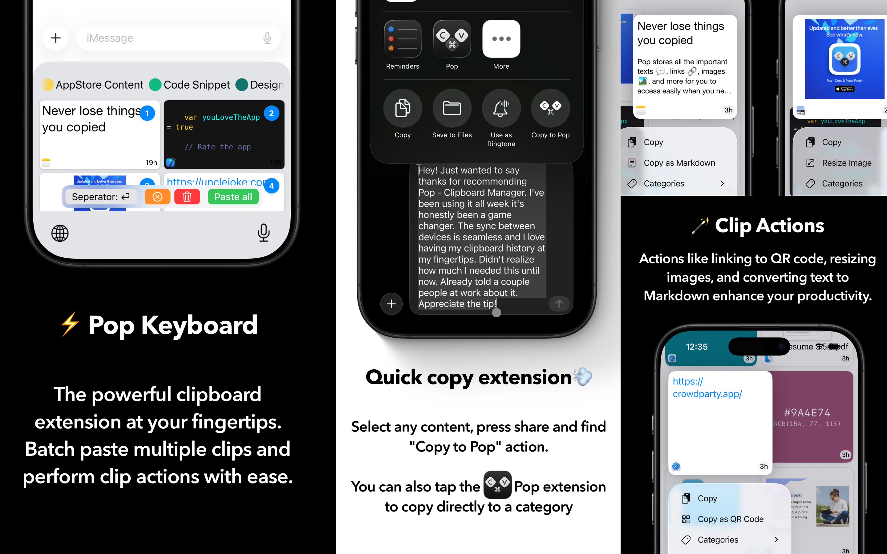
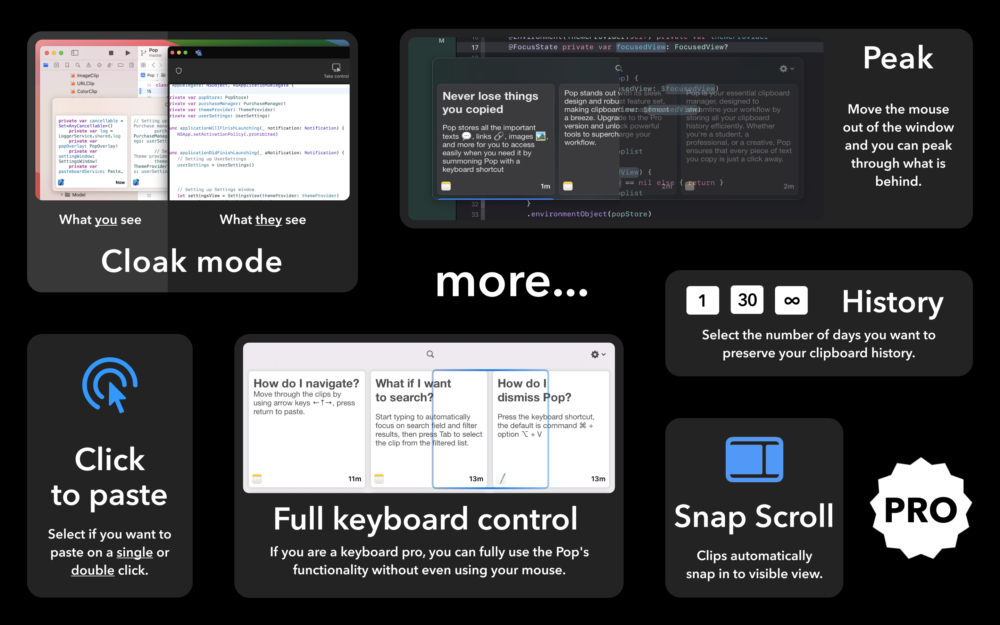

<table style="width: 100%">
  <tr>
    <td rowspan="2">
        

            
        

    </td>
    <td>
        <h1 align="center"><b>Pop - Copy & Paste Faster</b></h1>
        
<b>An extension to your workflow</b>

    </td>
  </tr>
  <tr>
    <td>
<b>Available on macOS 14.0+, iOS & iPadOS 17.4+</b>
</td>
  </tr>
  <tr>
    <td>
        

            <a href="https://apps.apple.com/app/pop-copy-paste-faster/id6499280268?mt=12">
            
        

    </td>
    <td>
        

            
        

    </td>
  </tr>
  <tr>
    <td colspan="2">
        
    </td>
  </tr>
</table>

## Preview
|   |  |
| :--------------------------------: | :-----------------------------------------: |
|  |           |
|  |           |

## Description
Pop is your essential clipboard manager, designed to streamline your workflow by keeping all your copied content organized and instantly accessible. Whether you’re a student, professional, or creative, Pop ensures that every piece of text, link, or image you copy is just a keystroke away.
With seamless integration across the Apple ecosystem, Pop – Paste, Organize, Perform – lets you manage your clipboard effortlessly on macOS, iOS, iPadOS, and visionOS using iCloud sync. No more re-copying the same things over and over or hunting through apps to find that one snippet you lost.

### Why Choose Pop?

Pop stands out with its clean design, powerful keyboard-driven workflow, and a thoughtful feature set that makes clipboard management feel natural instead of noisy. The Basic version includes the most-used features for free, and when you are ready to go deeper, Pop Pro unlocks advanced tools that supercharge power users without getting in the way.

**[Download Pop today and never lose track of your copied content again! ↗](https://apps.apple.com/app/pop-copy-paste-faster/id6499280268?mt=12)**

|                                                      **BASIC**                                                       |                                                                                                                                          **PRO**                                                                                                                                          |
| :------------------------------------------------------------------------------------------------------------------: | :----------------------------------------------------------------------------------------------------------------------------------------------------------------------------------------------------------------------------------------------------------------------------------------: |
| **3-Day Clipboard History:** Quickly access items you copied in the last three days so you never have to re-copy.   | **Advanced Interface Customization:** Personalize Pop with multiple layouts including Panel, Card, Mini, and Dock to match your workflow.                                                                                                                                                |
| **Multi-Platform Access:** Sync your clipboard across macOS, iOS, iPadOS, and visionOS with iCloud so your clips are always available. | **Enhanced Keyboard Navigation:** Navigate your clipboard with the arrow keys and paste with Enter for a fast, keyboard-only workflow that keeps your hands off the mouse.                                                                                                               |
| **Keyboard Shortcuts:** Invoke Pop from anywhere with shift ⇧ + command ⌘ + V, and instantly paste your first 9 clips with ⌥ + 1…9. | **Contextual Actions:** Perform powerful actions directly from clips, such as removing formatting, pasting as Markdown, resizing images, generating QR codes, and pasting color values.                                                                                                   |
| **Click-to-Paste:** Click any item in your history to paste it directly into the active app, quickly and effortlessly. | **Batch Pasting:** Select multiple clips and paste them in sequence with customizable separators such as return, tab, or comma for structured output.                                                                                                                                     |
| **Quick-Type Search:** Simply start typing to instantly filter your clipboard history by text, images, URLs, and more. | **Cloak Mode & History Control:** Keep Pop hidden during screenshots and screen sharing, and customize how long your clipboard history is preserved to balance convenience with privacy.                                                                                                  |

## Alternatives
As a long-time user of clipboard managers, I never upgraded when Paste moved to a subscription model, so I decided to build my own. During my development journey, I discovered several other clipboard managers while researching solutions for my feature ideas.

Here are some other clipboard managers I recommend you take a look at to see which fits your workflow better.
- [Maccy](https://maccy.app) - Set your price, recommended $12
- [Clipy](https://clipy-app.com) - Free
- [Paste](https://pasteapp.io) - $29.99/year subscription