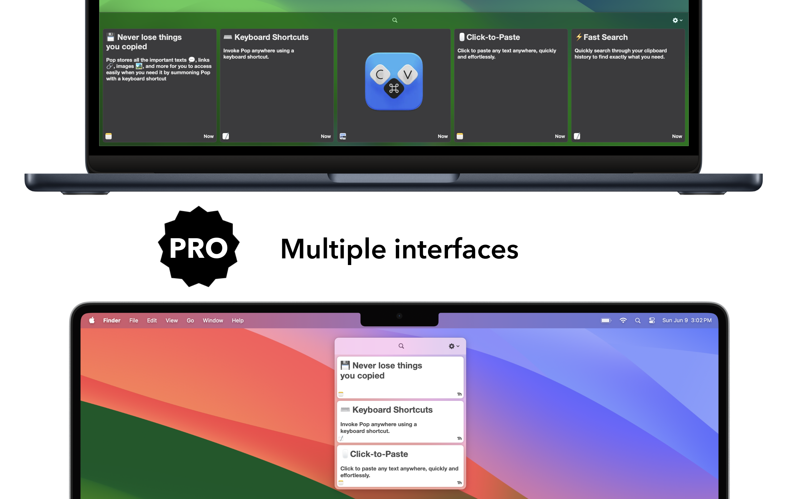
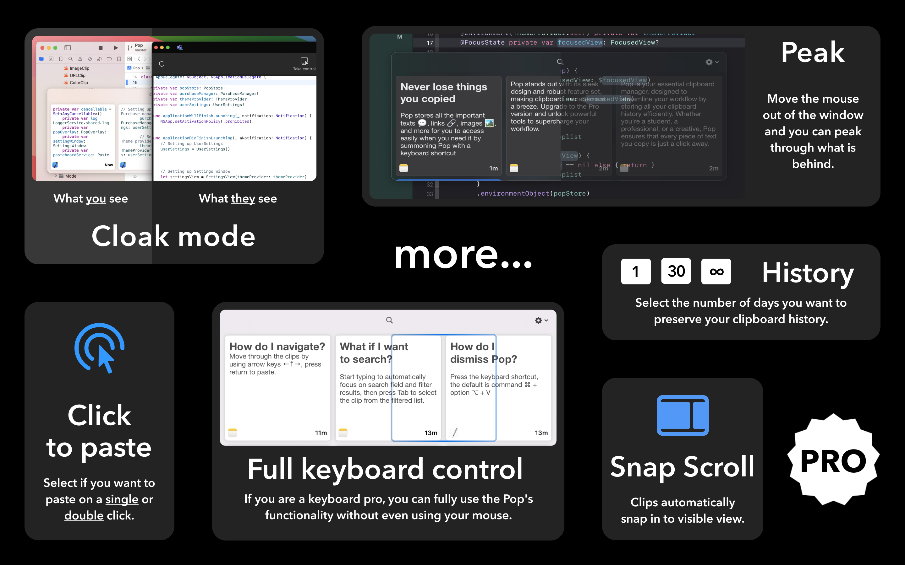

<table style="width: 100%">
  <tr>
    <td rowspan="2">
        

            
        

    </td>
    <td>
        <h1 align="center"><b>Pop - Copy & Paste Faster</b></h1>
        
<b>An extension to your workflow</b>

    </td>
  </tr>
  <tr>
    <td>
<b>Available on macOS 14.0+</b>
</td>
  </tr>
  <tr>
    <td colspan="2">
        

            <a href="https://apps.apple.com/app/pop-copy-paste-faster/id6499280268?mt=12">
            
        

    </td>
  </tr>
  <tr>
    <td colspan="2">
        
    </td>
  </tr>
</table>

## Preview
|   |  |
| :--------------------------------: | :-----------------------------------------: |
|  |           |

## Description
Pop is your essential clipboard manager, designed to streamline your workflow by storing all your clipboard history efficiently. Whether you're a student, a professional, or a creative, Pop ensures that every piece of text, link, images you copy is just a keypress away.

### Why Choose Pop?

Pop stands out with its sleek design and robust feature set, making clipboard management a breeze. The Basic version provides the most used features for free. If you are hooked and need more advanced functionality then upgrade to the Pro version to unlock powerful tools to supercharge your workflow.

**[Download Pop today and never lose track of your copied content again! ↗](https://apps.apple.com/ca/app/weekly-for-reminders/id6455786964?mt=12)**

|                                                      **BASIC**                                                      |                                                                                                      **PRO**                                                                                                      |
| :-----------------------------------------------------------------------------------------------------------------: | :---------------------------------------------------------------------------------------------------------------------------------------------------------------------------------------------------------------: |
|                 **3-Day History:** Access your clipboard history from the last 48 hours with ease.                  |                   **Advanced Interface Options:** Customize the look and feel to suit your preferences. You can select between, panel, card and dock. More customization option are on the way.                   |
| **Keyboard Shortcuts:** Invoke Pop anywhere using a keyboard shortcut. Default shortcut is shift ⇧ + command ⌘ + v. | **Keyboard Only Operation:** Navigate your clipboard history using arrow keys and paste selections with the Enter key, without ever touching the mouse. Enhance productivity with seamless keyboard-only control. |
|                   **Click-to-Paste:** Click to paste any text anywhere, quickly and effortlessly.                   |                                             **Cloak Mode:** Keep Pop invisible during screenshots and video recordings, ensuring a clean and distraction-free output.                                             |
|            **Fast Search:** Quickly search through your clipboard history to find exactly what you need.            |                                        **Customizable History Duration:** Choose how many days of clipboard history you want to preserve, tailored to your specific needs.                                        |

## Alternatives
As a long-time user of clipboard managers, I never upgraded when Paste moved to a subscription model, so I decided to build my own. During my development journey, I discovered several other clipboard managers while researching solutions for my feature ideas.

Here are some other clipboard managers I recommend you take a look at to see which fits your workflow better.
- [Maccy](https://maccy.app) - Set your price, recommended $12
- [Clipy](https://clipy-app.com) - Free
- [Paste](https://pasteapp.io) - $29.99/year subscription